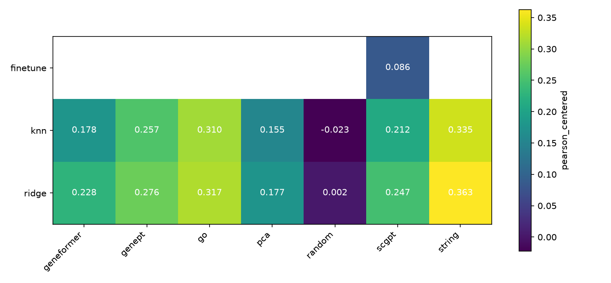

# pbench: do single-cell foundation models help predict unseen knockdowns?

Given a CRISPRi knockdown of a gene that was **never perturbed in training**, predict how the expression
of 5,000 genes changes. Recent papers report that simple linear baselines match deep models on this task.
This repo builds a strong, leakage-tested baseline suite and then asks, using the same models and the same
evaluator, whether gene embeddings from two single-cell foundation models (**scGPT** and **Geneformer**)
carry information that cheaper gene representations don't.

**Short answer: on Replogle K562 essential, no.** Foundation-model embeddings beat random features and
an embedding learned from the screen itself (PCA), but they are significantly *worse* than curated
prior knowledge (the STRING protein network and GO annotations) and than GenePT, a text embedding of
NCBI gene summaries. They don't win on any subgroup of knockdowns we looked at.

**Fine-tuning doesn't change that (Phase 2).** scGPT fine-tuned end to end with its official perturbation
recipe does *worse* on knockdown-specific signal than ridge regression on its own frozen embeddings.
The one thing it learns well is to lower the expression of the gene it is told was knocked down.

## Setup

**Data.** Replogle et al. 2022 K562 essential screen, GEARS-preprocessed release: 162,751 cells,
5,000 highly variable genes, 10,691 control cells, 1,092 single-gene knockdowns (15–765 cells each).
Each knockdown is summarised as Δ = mean log-expression of its cells − mean of the control cells.

**Task and split.** 5-fold cross-validation over *knockdowns* (never over cells). A model sees a vector
describing the knocked-down gene and must output its 5,000-gene Δ.

**Methods = model × gene embedding.**

| Models | Embeddings of the knocked-down gene |
|---|---|
| Ridge regression (α by inner 5-fold CV) | `random`: Gaussian control |
| kNN over training knockdowns (k by inner CV) | `pca`: PCA of the training-fold Δ matrix (how the gene's own expression moves across training knockdowns) |
| | `go`: GO annotations → 64-d SVD |
| | `string`: STRING v12 PPI (score ≥ 700) → spectral embedding |
| | `genept`: GenePT (ada-002 embedding of NCBI gene summaries) |
| | `scgpt`: scGPT whole-human gene token embeddings |
| | `geneformer`: Geneformer V2-104M input gene embeddings |

Plus reference points: `no_change` (Δ = 0), `train_mean` (average training Δ), and a **noise ceiling**.
`noise_ceiling` correlates Δ from two random halves of each knockdown's cells. Because models are
scored against the full-sample Δ, the comparable ceiling is the Spearman–Brown-corrected
`noise_ceiling_sb` = √(2r/(1+r)): the expected score of a noiseless predictor.

**Fair comparison.** A knockdown is evaluated only if *every* embedding in the run covers its target gene.
PCA can only embed the 412 targets that are among the 5,000 measured genes, so there are two runs:

- `main`: all embeddings except PCA, on **1,054** knockdowns.
- `main_measured`: all seven embeddings, on the **395** knockdowns whose target is measured.

**Metrics** (per held-out knockdown, then averaged with 95% bootstrap CIs):

- `pearson_all`: Pearson(predicted Δ, observed Δ) over all genes. This is the number usually reported, but it's easy to score well on: predicting the average response already gets 0.38.
- `pearson_de`: the same, over the knockdown's top-20 DE genes.
- **`pearson_centered`** (headline): Pearson after subtracting the training-fold mean Δ from both sides. It asks whether the model captured what is *specific* to this knockdown. `train_mean` scores exactly 0.
- `disc_rank`: rank of the true profile among all held-out profiles by L1 distance to the prediction (0 = perfect, 0.5 = chance).

Significance is tested with paired Wilcoxon signed-rank tests against the best non-foundation-model
method, Holm-corrected across methods.

## Results

### Main run (1,054 knockdowns)

| method            | pearson_all          | pearson_de           | pearson_centered       | disc_rank            |
|:------------------|:---------------------|:---------------------|:-----------------------|:---------------------|
| noise_ceiling_sb  | 0.815 [0.808, 0.822] | 0.990 [0.989, 0.992] | 0.809 [0.802, 0.816]   | nan [nan, nan]       |
| noise_ceiling     | 0.545 [0.533, 0.559] | 0.965 [0.962, 0.968] | 0.527 [0.515, 0.539]   | 0.081 [0.071, 0.090] |
| knn__string       | 0.530 [0.515, 0.545] | 0.648 [0.627, 0.671] | **0.419** [0.402, 0.436] | 0.269 [0.253, 0.285] |
| ridge__string     | 0.489 [0.473, 0.506] | 0.587 [0.565, 0.611] | 0.382 [0.365, 0.399]   | 0.325 [0.310, 0.343] |
| knn__go           | 0.511 [0.497, 0.526] | 0.614 [0.592, 0.635] | 0.376 [0.358, 0.393]   | 0.316 [0.299, 0.333] |
| ridge__go         | 0.496 [0.482, 0.510] | 0.590 [0.570, 0.612] | 0.362 [0.344, 0.378]   | 0.366 [0.349, 0.383] |
| ridge__genept     | 0.482 [0.468, 0.497] | 0.589 [0.568, 0.613] | 0.335 [0.318, 0.352]   | 0.377 [0.360, 0.393] |
| knn__genept       | 0.459 [0.443, 0.477] | 0.565 [0.540, 0.590] | 0.329 [0.310, 0.348]   | 0.294 [0.278, 0.311] |
| ridge__scgpt      | 0.436 [0.423, 0.449] | 0.525 [0.504, 0.548] | 0.264 [0.248, 0.279]   | 0.446 [0.430, 0.463] |
| ridge__geneformer | 0.429 [0.417, 0.442] | 0.519 [0.498, 0.542] | 0.244 [0.229, 0.258]   | 0.445 [0.429, 0.463] |
| knn__scgpt        | 0.438 [0.424, 0.453] | 0.519 [0.497, 0.544] | 0.239 [0.222, 0.256]   | 0.391 [0.374, 0.409] |
| knn__geneformer   | 0.399 [0.386, 0.412] | 0.479 [0.457, 0.501] | 0.161 [0.144, 0.176]   | 0.431 [0.414, 0.449] |
| no_change         | 0.000 [0.000, 0.000] | 0.000 [0.000, 0.000] | 0.077 [0.058, 0.095]   | 0.500 [0.483, 0.517] |
| knn__random       | 0.231 [0.221, 0.242] | 0.296 [0.274, 0.320] | 0.010 [-0.001, 0.021]  | 0.498 [0.480, 0.515] |
| train_mean        | 0.379 [0.369, 0.390] | 0.461 [0.440, 0.483] | 0.000 [0.000, 0.000]   | 0.500 [0.483, 0.517] |
| ridge__random     | 0.354 [0.344, 0.365] | 0.440 [0.418, 0.462] | -0.007 [-0.018, 0.004] | 0.501 [0.484, 0.519] |


**Reading the heatmap.** The embedding matters much more than the model. The ranking
STRING > GO > GenePT > scGPT > Geneformer ≫ random holds for both ridge and kNN. The best method,
kNN on STRING (0.419), closes about half (52%) of the gap between `train_mean` (0) and the
corrected noise ceiling (0.809), so there is plenty of room left.

### Measured-target run (395 knockdowns, adds PCA)

Same ranking. The best method here is `ridge__string` (0.356), with `knn__string` slightly behind
(Δ = −0.025, p_holm = 0.015). scGPT (0.230) and Geneformer (0.221) with ridge beat the data-only PCA
embedding (0.185), by +0.045 (p_holm = 5e-4) and +0.037 (p_holm = 0.004) respectively
(`paired_tests_fm_vs_pca.csv`; Holm over the four FM methods). Both are still about 0.13 below STRING
(p_holm < 1e-17). Full tables: `results/final/main_measured/`.

## Where, if anywhere, do foundation models help?


Reference baseline: `knn__string`, the best method that doesn't use a foundation model, on 1,054 knockdowns.

- **Overall, not at all.** Every scGPT and Geneformer variant is significantly below the reference on the
  headline metric: Δ from −0.155 (`ridge__scgpt`) to −0.258 (`knn__geneformer`), all p_holm < 1e-60. The
  same holds on `pearson_all`, `pearson_de` and `disc_rank`. Looking at individual knockdowns, an FM
  variant beats the reference on only 19–25% of them (for comparison, `knn__go` does on 45%).
- **Not on any subgroup** (figure above; knockdowns split into tertiles, 95% CIs). The gap is smallest for
  knockdowns with **weak effects** and those **least similar to any training knockdown**, where there
  is the least signal for any method to capture; the FMs still don't catch up. All CIs stay below zero.
- **Not on poorly annotated genes either.** A natural hope is that FMs compensate where curated knowledge
  is thin. Splitting by number of GO annotations, the FM gap is *largest* for the least-annotated
  tertile (−0.16 to −0.29) and smallest for the best-annotated one.
- **What they do carry:** clear signal compared with random features (+0.25 to +0.27 for ridge), and more than an
  embedding learned from the screen itself (PCA, see above). But a 1,536-d text embedding of gene
  descriptions (GenePT) is better than both FMs, which suggests the useful part of a gene representation
  here is literature-level functional knowledge, which STRING and GO encode more directly.

## Phase 2: does fine-tuning scGPT help?

Phase 1 used frozen gene embeddings. scGPT also ships a perturbation model meant to be fine-tuned end to
end. It reads a control cell's expression, together with a flag marking which input gene is knocked
down, and predicts the perturbed cell. We fine-tuned it with the official recipe (`Tutorial_Perturbation`,
whole-human checkpoint) in a separate environment (`phase2/`). It wrote the same predictions files and
was scored by the same evaluator, on the **same held-out knockdowns** as the baselines.
`phase2/README.md` has the details and the small deviations needed to fit a 16 GB GPU, none of which
changes the maths.

**Scope.** scGPT can only flag a knockdown whose target is one of its 5,000 input genes, so Phase 2 uses
the 395-knockdown measured set. It covers CV folds 0 and 1 (158 held-out knockdowns), with one seed
per fold. Each fold took 1–2 h on the laptop GPU.

**Sanity check first.** Before comparing anything, we reproduced a published scGPT run. Ahlmann-Eltze
et al. (2025) fine-tuned scGPT on this dataset with the GEARS split. On the same metric (Pearson Δ over
the 1,000 most expressed genes, 104 measured test knockdowns):

| | ours | Ahlmann-Eltze et al. (seeds 1 / 2) |
|---|---|---|
| mean baseline (`train_mean`) | 0.377 | 0.398 / 0.410 |
| fine-tuned scGPT | 0.370 | 0.290 / 0.344 |

Our run is in the published range: fine-tuned scGPT lands at or below the mean baseline in both.

### Results (folds 0–1, 158 knockdowns)

| method | pearson_all | pearson_de | pearson_centered | disc_rank |
|:--|:--|:--|:--|:--|
| noise_ceiling_sb | 0.834 [0.816, 0.852] | 0.991 [0.988, 0.993] | 0.818 [0.799, 0.835] | – |
| ridge__string (best baseline) | 0.522 [0.488, 0.558] | 0.575 [0.521, 0.624] | **0.363** [0.319, 0.404] | 0.332 [0.285, 0.380] |
| ridge__go | 0.478 [0.447, 0.509] | 0.518 [0.471, 0.565] | 0.317 [0.274, 0.359] | 0.463 [0.418, 0.517] |
| ridge__scgpt (frozen embedding) | 0.463 [0.431, 0.495] | 0.498 [0.446, 0.549] | 0.247 [0.213, 0.282] | 0.471 [0.424, 0.522] |
| knn__scgpt (frozen embedding) | 0.466 [0.435, 0.498] | 0.507 [0.452, 0.560] | 0.212 [0.171, 0.254] | 0.412 [0.361, 0.465] |
| ridge__pca | 0.432 [0.402, 0.461] | 0.469 [0.416, 0.519] | 0.177 [0.141, 0.216] | 0.498 [0.454, 0.549] |
| **finetune__scgpt** | 0.373 [0.350, 0.396] | 0.584 [0.545, 0.621] | 0.086 [0.068, 0.105] | 0.479 [0.433, 0.529] |
| train_mean | 0.426 [0.397, 0.454] | 0.464 [0.411, 0.515] | 0.000 | 0.500 [0.456, 0.552] |

Full table: `results/final/phase2/summary.md`.



- **Fine-tuning makes scGPT worse.**
  - On the headline metric, fine-tuned scGPT (0.086) is far below ridge on scGPT's *frozen* embeddings
    (−0.16, p_holm < 1e-10).
  - It is also below the data-only PCA embedding (−0.09) and the best baseline (−0.28).
  - Its `pearson_all` is below `train_mean`, and its `disc_rank` (0.48) is close to chance.
  - It doesn't catch up in any subgroup: across all tertiles of effect size, similarity to training
    knockdowns and GO annotation count, its gap to the best baseline stays between −0.17 and −0.45
    (`results/final/phase2/breakdown.csv`).
- **Its one apparent strength is the knocked-down gene itself.** On `pearson_de` it ties the best
  baseline (0.584 vs 0.575, p = 0.65). Splitting the knocked-down gene out of its own DE set shows
  why (`results/final/phase2/target_gene.csv`):

  | | predicted Δ of the target gene (observed −0.75) | pearson_de on the other DE genes |
  |---|---|---|
  | finetune__scgpt | **−0.73** | 0.460 |
  | ridge__string | −0.02 | **0.667** |
  | train_mean | −0.02 | 0.515 |

  The fine-tuned model reproduces the knockdown of the flagged gene almost exactly. No embedding
  baseline can do this, because nothing marks the target's position in its input. On every other DE
  gene, fine-tuned scGPT is below even the mean baseline. So in this setup the "perturbation model"
  learns the CRISPRi knockdown it was given as input, plus an average response. It does not learn how
  the knockdown propagates to other genes.
- **Why the frozen embeddings do better:** ridge and kNN on scGPT's gene embeddings learn a direct map
  from "which gene" to "which response". They borrow from training knockdowns whose targets have
  similar embeddings. The fine-tuned model must route the same information through a single flag
  token in a 1,536-gene context, and ~300 training knockdowns are too few for that.

**Caveats specific to Phase 2.**
- Two of the five folds, one seed per fold, so the CIs are wider than Phase 1's.
- Measured targets only.
- A per-knockdown cap of 100 cells per epoch, and at most 15 epochs. Fold 0 stopped early at epoch 8
  (best epoch 3); fold 1 ran all 15 (best epoch 13).
- Validation picks the epoch by Pearson Δ, a model-selection choice the tutorial makes differently
  (`phase2/README.md`).
- The gap to the baselines is large relative to all of these, and it agrees with the published run
  above.

## Caveats

- **One cell line, one screen.** K562 essential genes are well studied and strongly connected in STRING,
  which favours knowledge-graph embeddings. Replicating on RPE1 is the obvious next check.
- **Static FM embeddings.** Phase 1 uses each model's input gene-token embeddings, not context-dependent
  embeddings computed from K562 cells. Fine-tuning scGPT end to end (Phase 2, above) did not help.
- **STRING includes co-expression evidence** from public expression data. That's prior knowledge, not
  leakage from this screen, but it partly explains STRING's strength.
- **The headline metric is scale-invariant.** It ignores prediction magnitude, so inner CV often picks very
  strong ridge regularisation (α = 1e4–1e6), which shrinks predictions toward the training mean. Read
  `pearson_centered` together with `disc_rank`, which does penalise this. It also means `no_change`
  scores slightly above 0 (0.077): predicting "less than average" correlates with knockdowns that have
  weak effects.
- **Noise ceiling.** The raw split-half ceiling understates what is achievable (half samples are
  noisier). Use `noise_ceiling_sb`, which corrects for this but assumes the two halves are parallel
  measurements, and both halves share the control mean.
- **Run-to-run variance.** Multi-threaded BLAS makes refits differ in the last digits, and when inner-CV
  scores are near-tied this can flip the chosen hyperparameter. Between two identical runs, the
  measured-run `ridge__string` score moved by 0.012. Differences smaller than ~0.02 shouldn't be
  over-read.

## Reproduce

Hardware: one laptop (RTX 4090 Laptop GPU 16 GB, 15 GB RAM). Phase 1 runs entirely on CPU.

```bash
uv sync --extra dev --extra fm            # Python 3.11; fm = torch, safetensors, huggingface_hub, gdown
uv run pbench download                    # ~1.9 GB → data/raw/ (sha256 in data/raw/manifest.json)
uv run pbench preprocess                  # ~15 s, peak ~4 GB RAM
uv run pbench run configs/main.yaml       # ~6 min, peak ~3 GB RAM
uv run pbench run configs/main_measured.yaml   # ~4 min
uv run pbench report configs/main.yaml && uv run pbench report configs/main_measured.yaml
uv run pytest -q                          # 72 tests, synthetic data, ~8 s
```

Phase 2 (GPU, separate conda env; about 9 h in total on the laptop: GEARS split 4.7 h, folds 1.1 h and
1.8 h): see `phase2/README.md` for the full command list.

```bash
conda env create -f phase2/environment.yml && conda run -n pbench-phase2 pip install -e phase2
uv run pbench export-splits configs/main_measured.yaml --folds 0 1
conda run -n pbench-phase2 python -m scgpt_ft split-gears
# … scgpt_ft run for the GEARS split and folds 0–1 (phase2/README.md) …
uv run pbench score-external configs/phase2.yaml && uv run pbench report configs/phase2.yaml
```

If `gdown` hits a Google Drive quota, download scGPT's `whole_human` folder manually into
`data/raw/scgpt_human/`.

**Leakage guard:** `tests/test_run.py::test_no_leakage_from_held_out_rows` replaces every held-out
knockdown's data with noise and requires byte-identical predictions.

## References

- Replogle et al. (2022). Mapping information-rich genotype-phenotype landscapes with genome-scale Perturb-seq. *Cell*.
- Roohani, Huang & Leskovec (2023). Predicting transcriptional outcomes of novel multigene perturbations with GEARS. *Nature Biotechnology*.
- Cui et al. (2024). scGPT: toward building a foundation model for single-cell multi-omics using generative AI. *Nature Methods*.
- Theodoris et al. (2023). Transfer learning enables predictions in network biology. *Nature*. (Geneformer)
- Chen & Zou (2024). GenePT: a simple but effective foundation model for genes and cells built from ChatGPT. *bioRxiv*.
- Ahlmann-Eltze, Huber & Anders (2024/2025). Deep learning-based predictions of gene perturbation effects do not yet outperform simple linear baselines. *bioRxiv* / *Nature Methods*.
- Szklarczyk et al. (2023). The STRING database in 2023. *Nucleic Acids Research*.
