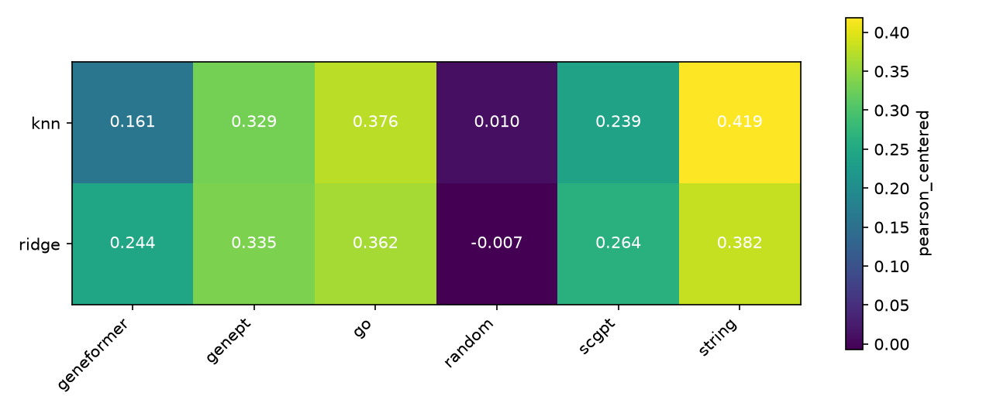
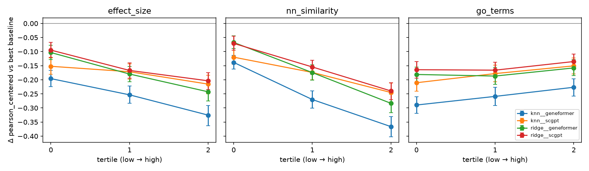

# pbench: do single-cell foundation models help predict unseen knockdowns?

Given a CRISPRi knockdown of a gene that was **never perturbed in training**, predict how the expression
of 5,000 genes changes. Recent papers report that simple linear baselines match deep models on this task.
This repo builds a strong, leakage-tested baseline suite and then asks, using the same models and the same
evaluator, whether gene embeddings from two single-cell foundation models (**scGPT** and **Geneformer**)
carry information that cheaper gene representations don't.

**Short answer: on Replogle K562 essential, no.** Foundation-model embeddings beat random features and
an embedding learned from the screen itself (PCA), but they are significantly *worse* than curated
prior knowledge (the STRING protein network and GO annotations) and than GenePT, a text embedding of
NCBI gene summaries. They don't win on any subgroup of knockdowns we looked at.

## Setup

**Data.** Replogle et al. 2022 K562 essential screen, GEARS-preprocessed release: 162,751 cells,
5,000 highly variable genes, 10,691 control cells, 1,092 single-gene knockdowns (15–765 cells each).
Each knockdown is summarised as Δ = mean log-expression of its cells − mean of the control cells.

**Task and split.** 5-fold cross-validation over *knockdowns* (never over cells). A model sees a vector
describing the knocked-down gene and must output its 5,000-gene Δ.

**Methods = model × gene embedding.**

| Models | Embeddings of the knocked-down gene |
|---|---|
| Ridge regression (α by inner 5-fold CV) | `random`: Gaussian control |
| kNN over training knockdowns (k by inner CV) | `pca`: PCA of the training-fold Δ matrix (how the gene's own expression moves across training knockdowns) |
| | `go`: GO annotations → 64-d SVD |
| | `string`: STRING v12 PPI (score ≥ 700) → spectral embedding |
| | `genept`: GenePT (ada-002 embedding of NCBI gene summaries) |
| | `scgpt`: scGPT whole-human gene token embeddings |
| | `geneformer`: Geneformer V2-104M input gene embeddings |

Plus three reference points: `no_change` (Δ = 0), `train_mean` (average training Δ), and a
**noise ceiling** (correlating Δ from two random halves of each knockdown's cells).

**Fair comparison.** A knockdown is evaluated only if *every* embedding in the run covers its target gene.
PCA can only embed the 412 targets that are among the 5,000 measured genes, so there are two runs:

- `main`: all embeddings except PCA, on **1,054** knockdowns.
- `main_measured`: all seven embeddings, on the **395** knockdowns whose target is measured.

**Metrics** (per held-out knockdown, then averaged with 95% bootstrap CIs):

- `pearson_all`: Pearson(predicted Δ, observed Δ) over all genes. This is the number usually reported, but it's easy to score well on: predicting the average response already gets 0.38.
- `pearson_de`: the same, over the knockdown's top-20 DE genes.
- **`pearson_centered`** (headline): Pearson after subtracting the training-fold mean Δ from both sides. It asks whether the model captured what is *specific* to this knockdown. `train_mean` scores exactly 0.
- `disc_rank`: rank of the true profile among all held-out profiles by L1 distance to the prediction (0 = perfect, 0.5 = chance).

Significance is tested with paired Wilcoxon signed-rank tests against the best non-foundation-model
method, Holm-corrected across methods.

## Results

### Main run (1,054 knockdowns)

| method            | pearson_all          | pearson_de           | pearson_centered       | disc_rank            |
|:------------------|:---------------------|:---------------------|:-----------------------|:---------------------|
| noise_ceiling     | 0.545 [0.533, 0.559] | 0.965 [0.962, 0.968] | 0.527 [0.515, 0.539]   | 0.081 [0.071, 0.090] |
| knn__string       | 0.529 [0.514, 0.544] | 0.648 [0.626, 0.670] | **0.418** [0.401, 0.435] | 0.270 [0.254, 0.286] |
| ridge__string     | 0.490 [0.474, 0.506] | 0.587 [0.566, 0.611] | 0.382 [0.365, 0.398]   | 0.326 [0.311, 0.344] |
| knn__go           | 0.511 [0.497, 0.526] | 0.614 [0.592, 0.635] | 0.376 [0.358, 0.393]   | 0.316 [0.299, 0.333] |
| ridge__go         | 0.496 [0.482, 0.510] | 0.590 [0.570, 0.612] | 0.362 [0.344, 0.378]   | 0.366 [0.349, 0.383] |
| ridge__genept     | 0.482 [0.468, 0.497] | 0.589 [0.568, 0.613] | 0.335 [0.318, 0.352]   | 0.377 [0.360, 0.393] |
| knn__genept       | 0.459 [0.443, 0.477] | 0.565 [0.540, 0.590] | 0.329 [0.310, 0.348]   | 0.294 [0.278, 0.311] |
| ridge__scgpt      | 0.436 [0.423, 0.449] | 0.525 [0.504, 0.548] | 0.264 [0.248, 0.279]   | 0.446 [0.430, 0.463] |
| ridge__geneformer | 0.429 [0.417, 0.442] | 0.519 [0.498, 0.542] | 0.244 [0.229, 0.258]   | 0.445 [0.429, 0.463] |
| knn__scgpt        | 0.438 [0.424, 0.453] | 0.519 [0.497, 0.544] | 0.239 [0.222, 0.256]   | 0.391 [0.374, 0.409] |
| knn__geneformer   | 0.399 [0.386, 0.412] | 0.479 [0.457, 0.501] | 0.161 [0.144, 0.176]   | 0.431 [0.414, 0.449] |
| no_change         | 0.000 [0.000, 0.000] | 0.000 [0.000, 0.000] | 0.077 [0.058, 0.095]   | 0.500 [0.483, 0.517] |
| knn__random       | 0.231 [0.221, 0.242] | 0.296 [0.274, 0.320] | 0.010 [-0.001, 0.021]  | 0.498 [0.480, 0.515] |
| train_mean        | 0.379 [0.369, 0.390] | 0.461 [0.440, 0.483] | 0.000 [0.000, 0.000]   | 0.500 [0.483, 0.517] |
| ridge__random     | 0.354 [0.344, 0.365] | 0.440 [0.418, 0.462] | -0.007 [-0.018, 0.004] | 0.501 [0.484, 0.519] |



**Reading the heatmap.** The embedding matters much more than the model. The ranking
STRING > GO > GenePT > scGPT > Geneformer ≫ random holds for both ridge and kNN. The best method,
kNN on STRING, closes about 79% of the gap between `train_mean` (0) and the noise ceiling (0.527).

### Measured-target run (395 knockdowns, adds PCA)

Same ranking. The best method here is `ridge__string` (0.344); `knn__string` is statistically tied
(Δ = −0.004, p_holm = 0.90). scGPT (0.230) and Geneformer (0.221) with ridge beat the data-only PCA
embedding (0.185), by +0.045 (p_holm = 5e-4) and +0.037 (p_holm = 0.004) respectively. Both are still
about 0.11–0.12 below STRING (p_holm < 1e-4). Full tables: `results/final/main_measured/`.

## Where, if anywhere, do foundation models help?



Reference baseline: `knn__string`, the best method that doesn't use a foundation model, on 1,054 knockdowns.

- **Overall, not at all.** Every scGPT and Geneformer variant is significantly below the reference on the
  headline metric: Δ from −0.154 (`ridge__scgpt`) to −0.257 (`knn__geneformer`), all p_holm < 1e-10. The
  same holds on `pearson_all`, `pearson_de` and `disc_rank`. Looking at individual knockdowns, an FM
  variant beats the reference on only 19–25% of them (for comparison, `knn__go` does on 46%).
- **Not on any subgroup** (figure above; knockdowns split into tertiles, 95% CIs). The gap is smallest for
  knockdowns with **weak effects** and those **least similar to any training knockdown**, but that's
  because every method does poorly there, not because the FMs improve. All CIs stay below zero.
- **Not on poorly annotated genes either.** A natural hope is that FMs compensate where curated knowledge
  is thin. Splitting by number of GO annotations, the FM gap is *largest* for the least-annotated
  tertile (−0.16 to −0.29) and smallest for the best-annotated one.
- **What they do carry:** clear signal compared with random features (+0.25 to +0.27 for ridge), and more than an
  embedding learned from the screen itself (PCA, see above). But a 1,536-d text embedding of gene
  descriptions (GenePT) is better than both FMs, which suggests the useful part of a gene representation
  here is literature-level functional knowledge, which STRING and GO encode more directly.

## Caveats

- **One cell line, one screen.** K562 essential genes are well studied and strongly connected in STRING,
  which favours knowledge-graph embeddings. Replicating on RPE1 is the obvious next check.
- **Static FM embeddings.** We use each model's input gene-token embeddings, not context-dependent
  embeddings computed from K562 cells, and we don't fine-tune. Phase 2 (fine-tuning scGPT's perturbation
  head and scoring it with the same evaluator) tests whether end-to-end training changes the picture.
- **STRING includes co-expression evidence** from public expression data. That's prior knowledge, not
  leakage from this screen, but it partly explains STRING's strength.
- **The headline metric is scale-invariant.** It ignores prediction magnitude, so inner CV often picks very
  strong ridge regularisation (α = 1e4–1e6), which shrinks predictions toward the training mean. Read
  `pearson_centered` together with `disc_rank`, which does penalise this. It also means `no_change`
  scores slightly above 0 (0.077): predicting "less than average" correlates with knockdowns that have
  weak effects.
- **Noise ceiling** shares the control mean between the two halves, so it is slightly optimistic.

## Reproduce

Hardware: one laptop (RTX 4090 Laptop GPU 16 GB, 15 GB RAM). Phase 1 runs entirely on CPU.

```bash
uv sync --extra dev --extra fm            # Python 3.11; fm = torch, safetensors, huggingface_hub, gdown
uv run pbench download                    # ~1.9 GB → data/raw/ (sha256 in data/raw/manifest.json)
uv run pbench preprocess                  # ~15 s, peak ~4 GB RAM
uv run pbench run configs/main.yaml       # ~6 min, peak ~3 GB RAM
uv run pbench run configs/main_measured.yaml   # ~4 min
uv run pbench report configs/main.yaml && uv run pbench report configs/main_measured.yaml
uv run pytest -q                          # 54 tests, synthetic data, ~3 s
```

If `gdown` hits a Google Drive quota, download scGPT's `whole_human` folder manually into
`data/raw/scgpt_human/`.

**Leakage guard:** `tests/test_run.py::test_no_leakage_from_held_out_rows` replaces every held-out
knockdown's data with noise and requires byte-identical predictions.

## References

- Replogle et al. (2022). Mapping information-rich genotype-phenotype landscapes with genome-scale Perturb-seq. *Cell*.
- Roohani, Huang & Leskovec (2023). Predicting transcriptional outcomes of novel multigene perturbations with GEARS. *Nature Biotechnology*.
- Cui et al. (2024). scGPT: toward building a foundation model for single-cell multi-omics using generative AI. *Nature Methods*.
- Theodoris et al. (2023). Transfer learning enables predictions in network biology. *Nature*. (Geneformer)
- Chen & Zou (2024). GenePT: a simple but effective foundation model for genes and cells built from ChatGPT. *bioRxiv*.
- Ahlmann-Eltze, Huber & Anders (2024/2025). Deep learning-based predictions of gene perturbation effects do not yet outperform simple linear baselines. *bioRxiv* / *Nature Methods*.
- Szklarczyk et al. (2023). The STRING database in 2023. *Nucleic Acids Research*.
